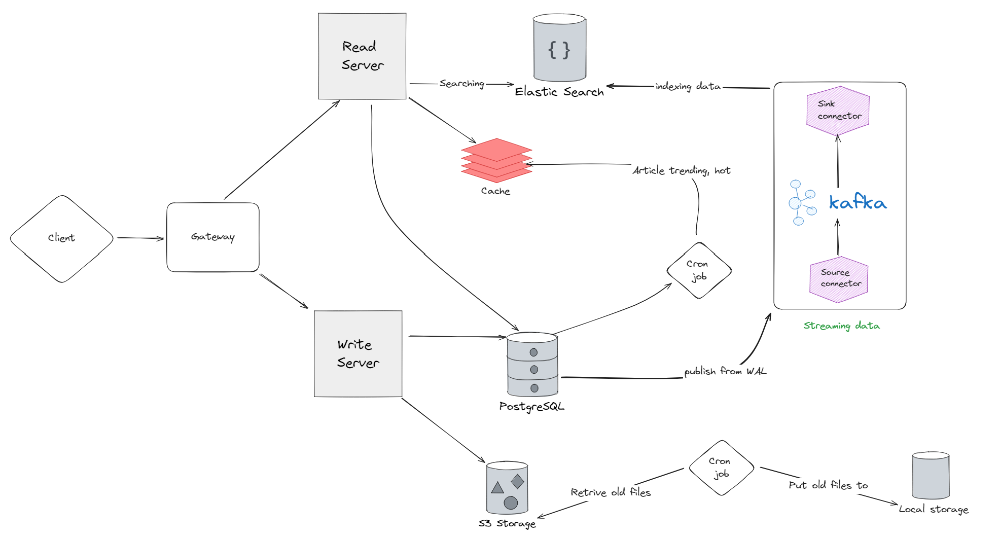

# System Design

## FUNCTION REQUIREMENTS:

    - user can login/logout
    - user can post the article
    - user can upload file
    - user can searching
    - user can like, comment, follow

## NON FUNCTION REQUIREMENTS:

    - high availability, latency < 500ms
    - total users: 100M
    - daily active user: 1M
    - 1 user upload 2 image per day
    - image size < 5MB
    --> Write 1 * 2 * 5MB * 1M = 10MB = 10TB
    - QPS: Write: 1M * 2(image upload) / (24hours * 60 minutes * 60 seconds) == 25 QPS
    - QPS: Read: 1M * 50 / (24hours * 60 minutes * 60 seconds) == 580 QPS
    ==> READ HEAVY
    - No lost for image

## Design system

# Getting started

## Installation

Clone the repository

    git clone https://github.com/anhtt2211/social-api.git

Switch to the repo folder

    cd social-api

Install dependencies

    npm install

Create file .env from .env.example and fill it

    cp .env.example .env

Run migration

    npm run migration:run <db_name>

---

## Running on docker

Build images

    docker-compose build

Run on docker

    docker-compose up

## NPM scripts

- `npm start` - Start application
- `npm run start:watch` - Start application in watch mode
- `npm run test` - run Jest test runner
- `npm run start:prod` - Build application

---

# Swagger API docs

This example repo uses the NestJS swagger module for API documentation. [NestJS Swagger](https://github.com/nestjs/swagger) - [www.swagger.io](https://swagger.io/)
