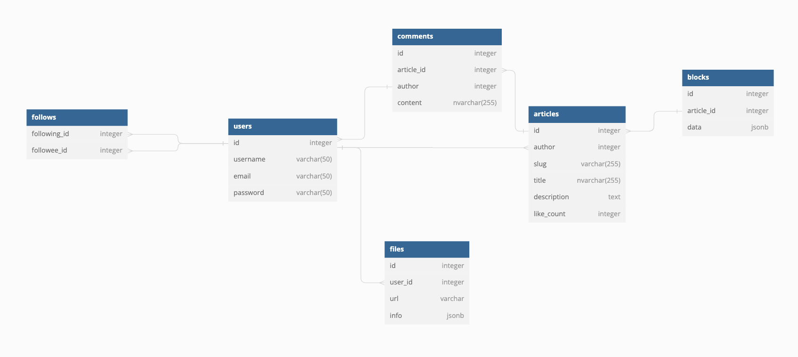

# Social platform System Design

## Requirements

Our system should meet the following requirements:

### Functional requirements

- User can login/logout
- User can post the article
- User can upload file
- User can searching
- User can like, comment, follow

### Non-Functional requirements

- High availability with minimal latency.
- High reliability, no uploads should be lost.
- The system should be scalable and efficient.

## Estimation and Constraints

Let's start with the estimation and constraints.

### Traffic

Let us assume we have:

- 100 million total users
- 10 million daily active users (DAU)
- Each user upload 2 articles a day
- Each user reads 20 articles a day

  This gives us 20 millions articles uploaded per day.

  $$
  10 \space million \times 2 \space articles = 20 \space million/day
  $$

**What would be Requests Per Second (RPS) for our system?**
Read per Second: 2300 requests/seconds

$$
\frac{200 \space million}{(24 \space hrs \times 3600 \space seconds)} = \sim 2.3K \space requests/second
$$

Write per Second: 230 requests/seconds

$$
\frac{20 \space million}{(24 \space hrs \times 3600 \space seconds)} = \sim 230 \space requests/second
$$

Read = 10 x Write => This is read-heavy system

### Storage

If we assume each images is 5 MB on average, we will require about 100 TB of storage every day.

$$
20 \space million \times 5 \space MB = 100  \space TB/day
$$

And for 10 years, we will require an astounding 1,825 PB of storage.

$$
100 \space TB \times 365 \space days \times 10 \space years = \sim 365 \space PB
$$

### Bandwidth

As our system is handling 100 TB of ingress every day, we will require a minimum bandwidth of around 1.15 GB per second.

$$
\frac{100 \space TB}{(24 \space hrs \times 3600 \space seconds)} = \sim 1.15 \space GB/second
$$

### High-level estimate

Here is our high-level estimate:

| Type                     | Estimate   |
| ------------------------ | ---------- |
| Daily active users (DAU) | 10 million |
| Read per second (RPS)    | 2300/s     |
| Write per second (RPS)   | 230/s      |
| Storage (per day)        | ~100 TB    |
| Storage (10 years)       | ~365 PB    |
| Bandwidth                | ~1.15 GB/s |

## Data model design

This is the general data model which reflects our requirements



## API design

Let us do a basic API design for our services:

### Login

```
request: {
    username: string,
    password: string
}
response: {
    accesstoken
    refreshtoken
}
```

### Logout

```
request: {
    token
}
response: {
    boolean
}
```

### Post Article

```
request: {
    userId: number
    title: string
    description: string
    content: jsonb
}
response: {
    articleId: number
    ... metadata
}
```

### Upload File

```
request: {
    string: base64
}
response: {
    url: string
    ... metadata
}
```

### Searching

```
request: {
    keyword: string
}
response: {
    Article[]
}
```

### Like

```
request: {
    userId: number
    articleId: number
}
response: {
    likeCount: number
}
```

### Commnent

```
request: {
    userId: number
    articleId: number
    content: string
}
response: {
    commentId: number
    ...metatdata
}
```

### Follow

```
request: {
    currentUserId: number
    toUserId: number
}
response: {
    boolean
}
```

## High-level design


It’s time to discuss our design decisions in detail.
